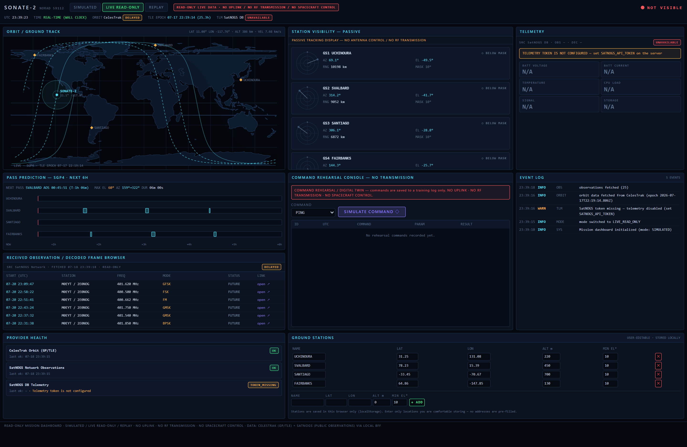
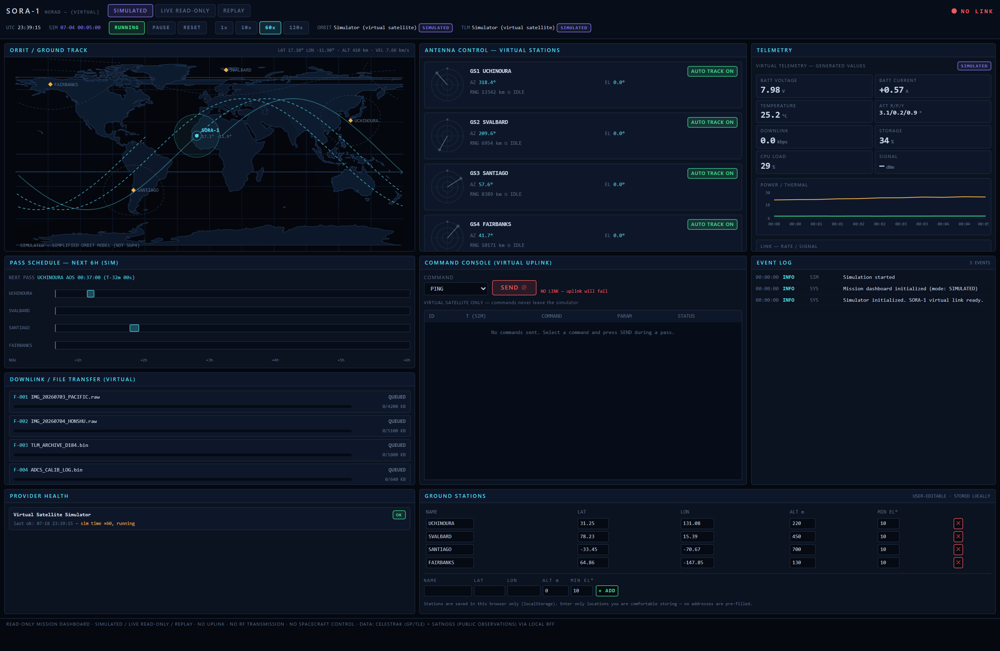
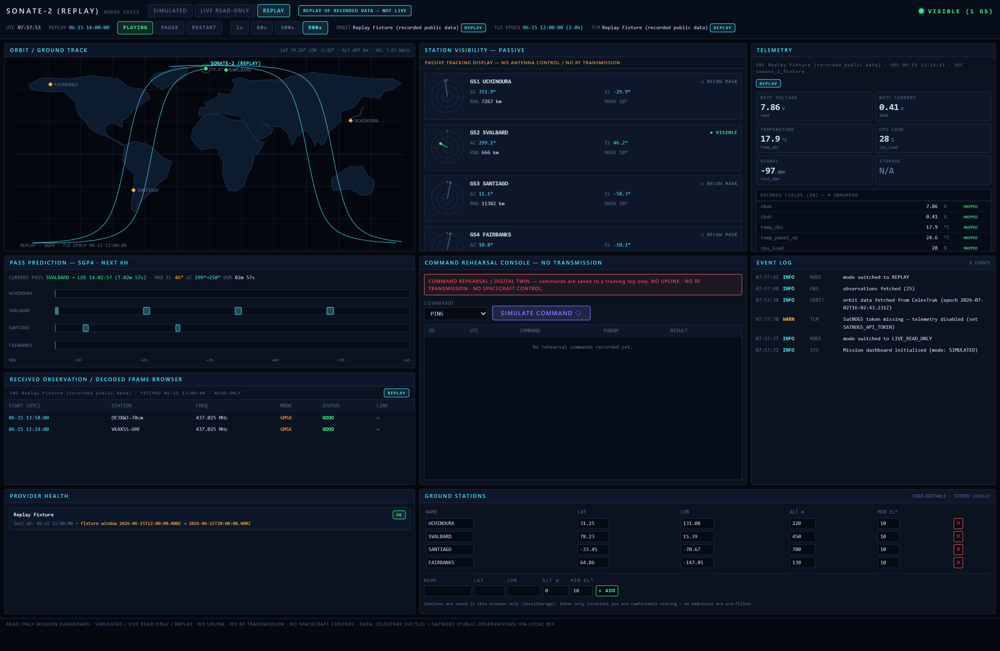
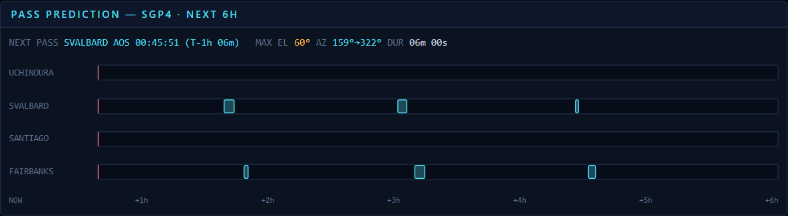
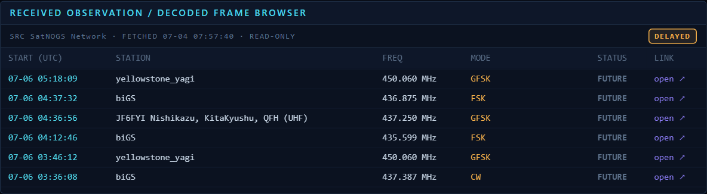
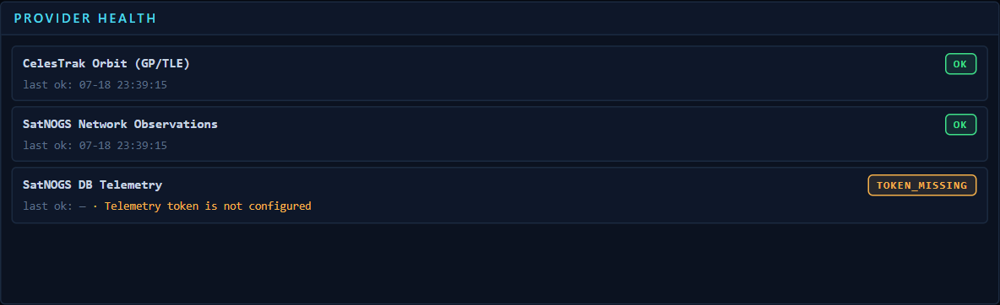
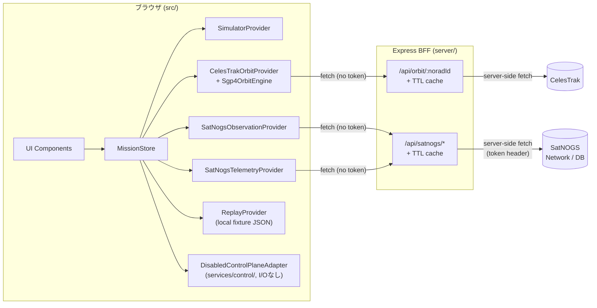

# Satellite Mission Operations Dashboard

> **Read-only satellite mission dashboard** — React 18 + TypeScript + Express BFF. Displays a virtual CubeSat simulation, real public orbit/telemetry data for an actual satellite (SONATE-2, NORAD 59112) via CelesTrak and SatNOGS, and a recorded-data replay mode. There is no code path that transmits commands, RF signals, or controls any spacecraft or ground station hardware — see [`docs/safety-and-scope.md`](docs/safety-and-scope.md).

## 日本語概要

これは教育・研究・ポートフォリオ用途の**衛星ミッション運用ダッシュボード**です。もともと単一ファイルの React MVP(`legacy/satellite-mission-control.jsx`、架空のCubeSat "SORA-1" を模した仮想ミッション管制画面)として書かれたものを、次の3層構成に分割・拡張しています。

- `src/` — React 18 + TypeScript + Vite 6 + Tailwind v4 のクライアント
- `server/` — Express製 BFF(Backend for Frontend)
- `shared/` — クライアント/サーバー間で共有するDTO型定義

3つのミッションモード(**SIMULATED** / **LIVE_READ_ONLY** / **REPLAY**)を画面上部のボタンでいつでも明示的に切り替えられます。実衛星(SONATE-2)を扱う LIVE_READ_ONLY モードは、CelesTrakの軌道要素とSatNOGSの公開観測・テレメトリを**読み取り専用**で表示するだけであり、コマンドを送信する経路そのものが存在しません。

> [!IMPORTANT]
> **本プロジェクトはコマンド送信・RF送信・アップリンク・衛星制御・地上局遠隔操作を一切行いません(READ-ONLY)。**
> 実装されているのは (1) 仮想衛星シミュレータ、(2) 公開データ(CelesTrak / SatNOGS)の読み取り専用表示、(3) 記録済みデータのリプレイのみです。実衛星・実RF機材・実地上局と通信するコードパスは存在せず、今後も追加しません。詳細な設計原則と根拠は [`docs/safety-and-scope.md`](docs/safety-and-scope.md) を参照してください。

## スクリーンショット

**LIVE_READ_ONLY モード** — 実衛星 SONATE-2 の実TLE、`DELAYED` 鮮度チップ、SatNOGSの実観測データ、トークン未設定時の `TOKEN_MISSING` テレメトリバナーを表示。



**SIMULATED モード** — 架空のCubeSat "SORA-1" を60倍速でシミュレートし、仮想アップリンク/ダウンリンクと簡易サイン波軌道モデルで動作。



**REPLAY モード** — `src/fixtures/sonate2-replay.json` に記録された観測・テレメトリ・TLEを再生。「REPLAY OF RECORDED DATA — NOT LIVE」のバナーを常時表示。



## 3モードの説明

| 項目 | SIMULATED | LIVE_READ_ONLY | REPLAY |
|---|---|---|---|
| 対象衛星 | 仮想衛星 SORA-1(架空) | 実衛星 SONATE-2(NORAD 59112) | SONATE-2 を模したリプレイ用フィクスチャ |
| 軌道モデル | 簡易サイン波モデル(`src/domain/simpleOrbit.ts`) | CelesTrak GP/TLE + クライアント側SGP4(`satellite.js`) | フィクスチャ内蔵TLE + 同じSGP4エンジン |
| 時間の進み方 | 内部シム時刻を1x/10x/60x/120xで進行 | 実時間(ウォールクロック) | フィクスチャ内の記録期間を1x/60x/300x/900xで再生 |
| パス予測 | 簡易可視判定 | 実際の仰角マスク(既定10°)に基づくAOS/LOS予測(二分探索で秒精度) | 同じロジックをフィクスチャのTLEに適用 |
| 観測データ | なし(仮想ダウンリンクパネルで代替) | SatNOGS Networkの公開観測一覧 | フィクスチャに記録された観測一覧 |
| テレメトリ | シミュレータが生成する仮想値 | SatNOGS DBのデコード済みテレメトリ(トークン必須) | フィクスチャに記録されたデコード済みフレーム |
| コマンド送信 | 仮想アップリンク(シミュレータ内で完結、`setTimeout`によるACKのみ) | Command Rehearsal Console — 「SIMULATE COMMAND」は訓練ログに記録するのみ、送信なし | 同じくリハーサルのみ、送信なし |
| データの位置付け | 完全に架空・作り物 | 実データだが読み取り専用 | 過去に記録/合成した固定データの再生 |
| Freshness表示 | `SIMULATED` | `LIVE` / `DELAYED` / `STALE` / `UNAVAILABLE` | `REPLAY` |

モード切替は常に `TopBar` 上のボタンによるユーザーの明示的な操作のみで行われ、`MissionStore.setMode`(`src/store/missionStore.ts`)以外に切替経路はありません。LIVE_READ_ONLYで通信に失敗しても SIMULATED への自動フォールバックは行われません。

## LIVE READ-ONLYの安全設計(要点)

- コマンドコンソールは `createCommandRehearsal()`(`src/domain/commandRehearsal.ts`)のみを呼び出す純粋関数で、`CommandRehearsal` 型の `transmitted` フィールドはリテラル型 `false` — I/Oを一切行わない。
- Control Plane(`src/services/control/`)はインターフェースと**唯一の実装である無効化アダプタのみ**で構成される。5つの capability フラグはすべてリテラル型 `false` であり、`transmitCommand()` 等の制御メソッドはすべて `CONTROL_PLANE_DISABLED` を投げるだけで何も行わない。
- SatNOGS APIトークンはBFF(`server/`)内でのみ使用され、ブラウザには一切露出しない(ヘルスチェックは真偽値 `satnogsTokenConfigured` のみ返す)。
- 実データと仮想データは `isSimulated` フラグ・鮮度チップ・モードバナー("READ-ONLY LIVE DATA · NO UPLINK / NO RF TRANSMISSION / NO SPACECRAFT CONTROL" / "REPLAY OF RECORDED DATA — NOT LIVE")によって常に明示され、混同しない設計。
- これらはすべて `tests/rehearsal.test.ts`、`tests/controlPlane.test.ts`、`tests/architecture.test.ts`、`tests/server.satnogs.test.ts` 等のテストで検証されている。

詳細な設計原則・禁止事項の根拠(コードパスが存在しないことの具体的な裏付け)は [`docs/safety-and-scope.md`](docs/safety-and-scope.md)、Control Plane境界の詳細は [`docs/control-plane-boundary.md`](docs/control-plane-boundary.md) にまとめています。

## 実装済み機能

- **SIMULATED**: 仮想衛星シミュレータ(`src/services/simulator/Simulator.ts`)。軌道・電源・姿勢・CPU負荷・信号強度などの仮想テレメトリ生成、地上局とのリンク判定、アンテナ自動追尾/手動オーバーライド(`AntennaPanel`, `SkyDial`)、仮想ファイルダウンリンク進捗(`DownlinkPanel`)、仮想コマンド送信・実行ログ(`CommandPanel`)。
- **LIVE_READ_ONLY**:
  - BFF経由でのCelesTrak GP/TLE取得(`server/routes/orbit.ts`)、in-memory TTLキャッシュと明示的な `staleCache` フォールバック
  - クライアント側SGP4伝播(`src/services/orbit/Sgp4OrbitEngine.ts`、`satellite.js` 6使用)による位置・地上軌跡の計算
  - 実際の仰角マスク(既定10°)に基づくパス予測(AOS/LOS二分探索精緻化、最大仰角、AOS/LOS方位角、`src/services/orbit/PassPredictionService.ts`)

    
  - 複数局のパスをマージしたNETコンタクトウィンドウ(`src/domain/netWindow.ts`)と、`CONTACT` / `PREP` / `IDLE` / `NO_WINDOW` を判定するコンタクトフェーズ(`src/domain/contactPhase.ts`)。TopBarのNET T−カウントダウンと24hパスタイムラインの両方がこの結果を共有
  - SatNOGS Networkの公開観測一覧の取得・表示(`server/routes/satnogs.ts`, `ObservationBrowser`)

    
  - SatNOGS DBのデコード済みテレメトリ取得・表示(トークン必須、`LiveTelemetryPanel`)。Known Field Mapping Layer(`src/domain/telemetryMapping.ts`)が正規表現ルールで衛星ごとに異なるデコーダのフィールド名を既知カード(電圧/電流/温度/CPU/信号/ストレージ)にマッピングしつつ、未知フィールドも生データ行として一覧表示。実測フィールドが無いカードは仮想値を表示せず `N/A`。
  - Command Rehearsal Console — コマンドは `CommandRehearsal` として記録されるのみで送信されない。各エントリは `createdInMode` / `createdAtWallClock`(実時間) / `contextTimestamp`(作成時点のミッション表示時計。REPLAYではリプレイカーソルで実時間とずれ得る)を分離して保持し、LIVE_READ_ONLYとREPLAYは独立した履歴を持つ
  - Provider Health パネルによる各データソースの状態表示(OK/DEGRADED/ERROR/TOKEN_MISSING/IDLE)

    
  - Operations Checklist と Advisory — 両方とも単一の `OperationalSnapshot`(`src/domain/operationalAssessment.ts`)から導出されるため、内容が食い違うことがない。リクエストがロード中の間は `PENDING`/`CHECKING` を表示し、時期尚早な `FAIL` を出さない。SatNOGSトークン未設定は `FAIL` ではなく `CONFIG_REQUIRED` と表示
  - TopBarのControl Planeステータスチップ — `CONTROL PLANE: DISABLED` / `REHEARSAL PLANE: LOCAL ONLY — NOT TRANSMITTED` を常時表示するだけの表示専用パーツで、ボタンや設定UIは一切持たない
- **REPLAY**: `src/fixtures/sonate2-replay.json` に記録された固定の観測・テレメトリ・TLEを、再生/一時停止/倍速切り替え付きで再生(`src/services/providers/ReplayProvider.ts`)
- **共通**: 地上局のCRUD(`GroundStationEditor`、`localStorage` 永続化、既定局は公開の実在施設4箇所(Uchinoura/Svalbard/Santiago/Fairbanks)のみでユーザー個人情報は初期値に含まない)、イベントログ(`EventLog`)、各パネルのprovenance/freshnessチップ表示、世界地図表示(`WorldMap` — Natural Earth由来の海岸線、昼夜ターミネータ、可視フットプリント円、過去実線/未来破線の地上軌跡、日付変更線・極付近も破綻しないポリゴン描画)
- **テスト**: `tests/` に vitest による自動テスト22ファイル・240テスト(TLE正規化 / SGP4ラッパー / パス予測・仰角マスク / 鮮度判定 / テレメトリフィールドマッピング / コマンドリハーサルが外部送信しないことの安全性テスト(両リハーサル対応モード×6種のI/O APIでパラメータ化) / Replay fixture / モード切替の非フォールバック / provider request lifecycle / OperationalSnapshotによるAdvisory・チェックリストの整合性 / Control Planeが構造的に無効であることの保証 / TypeScript ASTベースの依存方向アーキテクチャテスト / BFF orbitルート(成功・障害・STALEキャッシュ) / BFF SatNOGSルート(トークン欠如・データなし・API失敗・トークン非漏洩) / 球面幾何・フットプリント / 昼夜ターミネータ)。すべて実ネットワークに接続せず、注入したフェイク `fetch` 等で実行

## 明示的に実装していない機能(禁止範囲を含む)

以下は現時点で未実装の範囲です。

- 実衛星への周波数・変調・符号化を伴う実際の受信処理(SDR/RF受信機との統合)
- CCSDSやその他フレームフォーマットの自前デコーダ(現状はSatNOGSがデコード済みの値をそのまま利用)
- 認証・ユーザー管理・マルチユーザー対応(ローカル/個人利用を想定した単一クライアント構成)
- 複数衛星の同時追跡(現状はLIVE_READ_ONLYで1機、SONATE-2固定)
- 永続データベース(BFFのキャッシュはプロセス内メモリのみで、再起動すると消える)

以下は **意図的に実装しておらず、今後も実装しません**(詳細な根拠は [`docs/safety-and-scope.md`](docs/safety-and-scope.md)):

- **Uplink(衛星への信号送信)** — コマンドコンソールは `createCommandRehearsal()` のみを呼び出し、送信を行うネットワークI/Oは存在しません。
- **RF送信** — 送信機・アンテナ制御・変調器へのインターフェースは存在しません。
- **実衛星制御** — 姿勢制御・電源制御・モード切替など、実際の衛星バスやペイロードを操作するコードパスはありません。
- **地上局の遠隔操作** — 本アプリが地上局のハードウェア(回転台・受信機など)を操作することはありません。地上局情報はブラウザの `localStorage` に保存されるユーザー入力の座標データにすぎません。
- **実装を持つControl Planeアダプタ** — `src/services/control/` には `DisabledControlPlaneAdapter` という唯一の実装しか存在せず、5つの制御メソッドはすべて例外を投げるだけです。ビルド時フラグ `VITE_CONTROL_PLANE_MODE` によってこれ以外の実装が有効化される経路もありません(詳細は下記)。

## アーキテクチャ概要

UIは `SatelliteDataProvider` インターフェース(`getSatelliteProfile` / `getOrbitState` / `getPassPredictions` / `getRecentObservations` / `getTelemetry` / `getProviderHealth` / `refresh`)にのみ依存し、上流のCelesTrak/SatNOGS APIの形状を一切知りません。`MissionStore`(`src/store/missionStore.ts`)が3モードのプロバイダを切り替えて公開します。



詳細なデータフロー(シーケンス図含む)、鮮度モデル、モードごとの責務分離は [`docs/architecture.md`](docs/architecture.md)、Control Plane境界の詳細は [`docs/control-plane-boundary.md`](docs/control-plane-boundary.md) を参照してください。

### ディレクトリ構成

```
.
├── src/
│   ├── app/            # App.tsx — トップレベルレイアウト
│   ├── components/      # layout/ antenna/ telemetry/ map/ pass/ command/ logs/ mission/
│   ├── domain/          # 型定義・freshness・commandRehearsal・rehearsalPlane・operationalAssessment・
│   │                     # opsChecklist・advisory・telemetryMapping・simpleOrbit・mapPolygon 等(純粋関数)
│   ├── services/
│   │   ├── api/         # missionApi.ts — BFFへのfetchラッパー
│   │   ├── control/      # ControlPlane.ts(インターフェース)+ DisabledControlPlane.ts(唯一の実装)
│   │   ├── orbit/       # Sgp4OrbitEngine, PassPredictionService
│   │   ├── providers/   # SatelliteDataProvider実装5種
│   │   └── simulator/    # Simulator.ts — 仮想衛星
│   ├── store/           # missionStore.ts, useMissionStore.ts, groundStations.ts (localStorage)
│   ├── fixtures/         # sonate2-replay.json
│   └── vite-env.d.ts     # VITE_CONTROL_PLANE_MODE のImportMetaEnv型定義
├── server/
│   ├── routes/           # orbit.ts, satnogs.ts
│   ├── clients/          # celestrak.ts, satnogs.ts (上流API呼び出し)
│   ├── config.ts, cache.ts, app.ts, index.ts
├── shared/               # apiTypes.ts, tle.ts — クライアント/サーバー共有DTO
├── tests/                # vitest (22ファイル, 240テスト)
├── legacy/               # satellite-mission-control.jsx — プロジェクトの原型(単一ファイルMVP)
└── docs/
    ├── architecture.md
    ├── safety-and-scope.md
    ├── control-plane-boundary.md
    ├── scc-comparison.md
    └── screenshots/
```

## データソース

| データ | ソース | 取得経路 |
|---|---|---|
| 軌道要素(TLE/GP) | [CelesTrak](https://celestrak.org) | BFF `/api/orbit/:noradId` → `server/clients/celestrak.ts`(`gp.php?CATNR=...&FORMAT=TLE`) |
| 公開受信記録 | [SatNOGS Network](https://network.satnogs.org) | BFF `/api/satnogs/observations/:noradId`(トークン不要) |
| デコード済みテレメトリ | [SatNOGS DB](https://db.satnogs.org) | BFF `/api/satnogs/telemetry/:noradId`(トークン必須) |

クライアントは上記のいずれにも直接アクセスせず、必ずBFFを経由します。CelesTrakおよびSatNOGSの利用にあたっては、それぞれのサービスの利用規約・レート制限を尊重してください(本プロジェクトは両サービスの公式提供元ではありません)。

## 起動方法

前提: Node.js 18 以上。

```bash
# 依存関係のインストール
npm install

# .env を作成(任意設定。SATNOGS_API_TOKEN は未設定でも動作します)
cp .env.example .env

# 開発起動(Express BFF :8787 + Vite クライアント :5173 を同時起動、/api はViteからBFFへプロキシ)
npm run dev

# 本番ビルド(tsc --noEmit のあと vite build)
npm run build

# 本番起動(ビルド済み dist を BFF から配信)
npm start

# テスト実行 (vitest)
npm test

# Lint / 型チェック
npm run lint
npm run typecheck
```

環境変数の詳細(`PORT`, `CELESTRAK_BASE_URL`, `SATNOGS_DB_BASE_URL`, `SATNOGS_NETWORK_BASE_URL`, `SATNOGS_API_TOKEN`, `LIVE_DATA_CACHE_TTL_SECONDS`)は `.env.example` および `server/config.ts` を参照してください。

### `VITE_CONTROL_PLANE_MODE`(任意・クライアントビルド変数)

`parseControlPlaneMode()`(`src/services/control/ControlPlane.ts`)が読むVite ビルド時の任意変数です。**有効化できるものは何一つ存在しません** — 認識されるのは `"disabled"`(大文字小文字・前後空白は無視)のみで、未設定でも同じ扱いになります。それ以外の値(例: `"flight"`, `"enabled"`, `"1"`)を指定しても結果は常に `DISABLED` のままです(無効化アダプタ以外を構築する経路はコード上どこにも存在しません)が、値が認識されなかったことを示す `WARN` `CTRL` イベントがイベントログに記録されるため、設定ミスがサイレントに握りつぶされることはありません。詳細は [`docs/control-plane-boundary.md`](docs/control-plane-boundary.md) を参照してください。

## テスト

```bash
npm test
```

`tests/` 配下のvitestスイート(22ファイル・240テスト、すべて実ネットワーク非依存)には、以下のような安全性テストが含まれます。

- `tests/rehearsal.test.ts` — リハーサルコマンドが `fetch` を含む6種のI/O APIを一切呼び出さないことの検証(両リハーサル対応モードでパラメータ化)
- `tests/controlPlane.test.ts` — Control Planeアダプタが型レベル・実行時レベルの両方で構造的に無効であることと、同じネットワーク非到達性の検証
- `tests/architecture.test.ts` — TypeScript ASTベースで、Control Plane境界の依存方向が破られていないこと、`src/` 配下のどのファイルも `process.env` やSatNOGSトークンを参照していないことを検証
- `tests/server.satnogs.test.ts` — SatNOGS APIトークンがレスポンスに一切含まれないことの検証
- `tests/store.modeSwitch.test.ts` — LIVE_READ_ONLYからSIMULATEDへの自動フォールバックが発生しないことの検証
- `tests/operationalAssessment.test.ts` — 同一スナップショットから導出されるAdvisoryとOperations Checklistが決して食い違わないこと、リクエストがロード中の間はFAIL/CRITICALを一切出さないことの検証

## 今後のロードマップ

- 複数衛星選択(mission selector)
- テレメトリの時系列チャート表示
- RTL-SDR等、自前受信局アダプタとの統合
- CCSDS等のフレームフォーマットに対応した自前デコーダアダプタ
- より精密な熱・電源・姿勢モデルを持つ独自のCubeSatデジタルツイン
- 地上局スケジューリング(複数局・複数衛星のパス競合調整)
- 3D表示(地球儀・衛星姿勢の3Dビジュアライゼーション)
- Physical AI / ロボット・ミッション管制ダッシュボードへの一般化(衛星に限らずロボットや無人機の「読み取り専用監視 + 訓練用リハーサル」パターンへの応用)

いずれも「読み取り専用 / リハーサル専用」という設計原則([`docs/safety-and-scope.md`](docs/safety-and-scope.md))を維持したまま拡張することを想定しています。アーキテクチャの詳細は [`docs/architecture.md`](docs/architecture.md) を参照してください。
