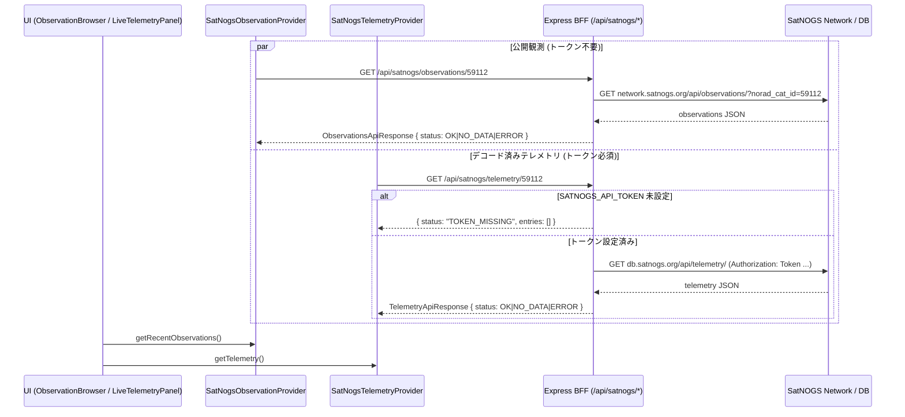
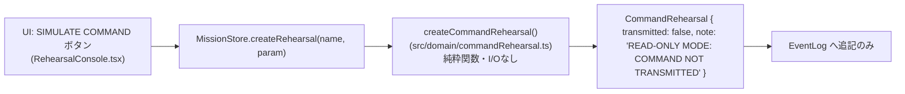

# アーキテクチャ

[`README.md`](../README.md) の概要を前提に、実装の内部構造を解説します。安全設計・禁止事項の根拠は [`safety-and-scope.md`](safety-and-scope.md) を参照してください。

## 目次

1. [Provider Architecture](#provider-architecture)
2. [BFF構成](#bff構成)
3. [Orbit data flow(LIVE_READ_ONLY)](#orbit-data-flowlive_read_only)
4. [SatNOGS data flow](#satnogs-data-flow)
5. [Command Rehearsal flow](#command-rehearsal-flow)
6. [データprovenance / freshnessモデル](#データprovenance--freshnessモデル)
7. [SIMULATED / LIVE_READ_ONLY / REPLAY の責務分離](#simulated--live_read_only--replay-の責務分離)

## Provider Architecture

UIコンポーネントと `MissionStore` は `SatelliteDataProvider` インターフェース(`src/services/providers/SatelliteDataProvider.ts`)と `src/domain/types.ts` の型にのみ依存し、CelesTrakやSatNOGSのAPI形状を一切知りません。

```typescript
export interface SatelliteDataProvider {
  readonly id: string;
  readonly label: string;
  getSatelliteProfile(): SatelliteProfile;
  getOrbitState(now: Date): OrbitState;
  getPassPredictions(stations: GroundStation[], now: Date): PassPrediction[];
  getRecentObservations(): ObservationSet;
  getTelemetry(): TelemetrySnapshot;
  getProviderHealth(): ProviderHealth[];
  refresh(now: Date): Promise<void>;
}
```

`refresh()` は非同期のデータ取得を行いますが**決して例外を投げず**、失敗は `getProviderHealth()` のステータス(`OK`/`DEGRADED`/`ERROR`/`TOKEN_MISSING`/`IDLE`)と各ゲッターが返す `error` フィールドを通じてのみ表面化します。getter群は常に同期的に「現在保持している状態」を返すだけの純粋な読み取りです。

実装は5種類あります。

| 実装 | ファイル | 用途 |
|---|---|---|
| `SimulatorProvider` | `src/services/providers/SimulatorProvider.ts` | SIMULATEDモード。`Simulator` クラスの状態を provider インターフェースにラップするだけ。すべて `isSimulated: true` / `freshness: "SIMULATED"` を付与 |
| `CelesTrakOrbitProvider` | `src/services/providers/CelesTrakOrbitProvider.ts` | LIVE_READ_ONLYの軌道。BFFの `/api/orbit/:noradId` を叩き、`Sgp4OrbitEngine` で伝播 |
| `SatNogsObservationProvider` | `src/services/providers/SatNogsObservationProvider.ts` | LIVE_READ_ONLYの公開観測一覧。BFFの `/api/satnogs/observations/:noradId` を叩く |
| `SatNogsTelemetryProvider` | `src/services/providers/SatNogsTelemetryProvider.ts` | LIVE_READ_ONLYのデコード済みテレメトリ。BFFの `/api/satnogs/telemetry/:noradId` を叩く |
| `ReplayProvider` | `src/services/providers/ReplayProvider.ts` | REPLAYモード。ローカルの `src/fixtures/sonate2-replay.json` のみを参照し、ネットワークアクセスは一切発生しない |

`MissionStore`(`src/store/missionStore.ts`)は上記5つのインスタンスを保持し、現在の `mode` に応じてどのプロバイダの結果を返すかを振り分けるだけのディスパッチャです(`getOrbitState()`, `getTelemetry()` などのメソッドがそれぞれ `if (this.mode === ...)` で分岐)。UIはこの `MissionStore` のメソッドしか呼ばないため、**UIコードのどこにも「upstream APIを直接叩く」コードパスが存在しません**。これは `src/services/api/missionApi.ts` が唯一の `fetch` 呼び出し元であり、それすら宛先は常に自サーバーの `/api/*` である、という設計で担保されています。

## BFF構成

`server/app.ts` の `createApp()` がExpressアプリを構築します。

- `GET /api/health` — `{ ok: true, satnogsTokenConfigured: boolean }` のみを返す。トークンの値そのものは絶対に含まれない。
- `/api/orbit` → `server/routes/orbit.ts`(`createOrbitRouter`)
- `/api/satnogs` → `server/routes/satnogs.ts`(`createSatnogsRouter`)

各ルーターは独立した `TtlCache`(`server/cache.ts`)インスタンスを持ちます(`orbitCache`, `obsCache`, `tlmCache`)。TTLは `ServerConfig.cacheTtlS`(既定600秒、環境変数 `LIVE_DATA_CACHE_TTL_SECONDS`)。設定は `server/config.ts` の `loadConfig()` が環境変数から読み込み、既定値へのフォールバックとトークンのtrim/null化を行います。

```typescript
export interface ServerConfig {
  port: number;
  celestrakBaseUrl: string;
  satnogsDbBaseUrl: string;
  satnogsNetworkBaseUrl: string;
  satnogsApiToken: string | null; // null when not configured — app must still work
  cacheTtlS: number;
}
```

ブラウザがCelesTrak/SatNOGSに直接アクセスしない理由は2つあります。

1. **トークン保護** — SatNOGS DBのAPIトークンはサーバー環境変数としてのみ存在し、`server/clients/satnogs.ts` がリクエストヘッダ(`Authorization: Token ...`)に付与する箇所以外に登場しません。クライアントバンドルには含まれず、レスポンスにも埋め込まれません。
2. **キャッシュとレート制御の一元化** — 複数タブ/複数回のUIレンダーが上流APIへの重複リクエストを発生させないよう、BFFのプロセス内メモリキャッシュがリクエストを吸収します。

## Orbit data flow(LIVE_READ_ONLY)

```mermaid
sequenceDiagram
  participant UI as UI (App.tsx)
  participant Store as MissionStore
  participant Provider as CelesTrakOrbitProvider
  participant Api as MissionApi (fetch)
  participant BFF as Express BFF (/api/orbit/:noradId)
  participant Cache as TtlCache&lt;OrbitApiResponse&gt;
  participant CT as CelesTrak (celestrak.org)

  UI->>Store: getOrbitState()
  Store->>Provider: getOrbitState(now)
  Note over Provider: 別途、tickループで定期的に refresh(now) が呼ばれる
  Provider->>Api: getOrbit(noradId)
  Api->>BFF: GET /api/orbit/59112
  BFF->>Cache: getFresh(key)
  alt キャッシュ有効
    Cache-->>BFF: cached OrbitApiResponse
  else キャッシュ切れ/なし
    BFF->>CT: GET gp.php?CATNR=59112&FORMAT=TLE
    alt 成功
      CT-->>BFF: TLE text
      BFF->>BFF: parseTleText() でチェックサム検証・正規化
      BFF->>Cache: set(key, payload)
    else 失敗
      BFF->>Cache: getAny(key)
      alt 古いキャッシュあり
        Cache-->>BFF: 古い OrbitApiResponse
        BFF->>BFF: staleCache=true, fetchError=msg を付与
      else キャッシュなし
        BFF-->>Api: 502 error
      end
    end
  end
  BFF-->>Api: OrbitApiResponse
  Api-->>Provider: OrbitApiResponse
  Provider->>Provider: new Sgp4OrbitEngine(tleLine1, tleLine2)
  Provider-->>Store: (内部状態を更新、次回 getOrbitState 呼び出しに反映)
  Store-->>UI: OrbitState { provenance, tle, position, track, error }
```

流れの要点:

1. **CelesTrak → BFF**: `server/clients/celestrak.ts` の `fetchGpTle()` が `CELESTRAK_BASE_URL/NORAD/elements/gp.php?CATNR=<id>&FORMAT=TLE` を叩きます。
2. **正規化**: `shared/tle.ts` の `parseTleText()` がTLEテキストをパースし、行チェックサム・NORAD ID一致・フォーマットを検証します(不正なら例外 → providerエラーとして扱われ、決してシミュレーションデータに差し替えられません)。
3. **キャッシュ**: `server/cache.ts` の `TtlCache` がプロセス内メモリにレスポンスを保持。キャッシュヒット時は上流に問い合わせません。上流失敗時は古いキャッシュを `staleCache: true` 付きで返す明示的フォールバック(`server/routes/orbit.ts`)。
4. **OrbitApiResponse → CelesTrakOrbitProvider**: クライアントの `MissionApi.getOrbit()` がBFFの `/api/orbit/:noradId` を呼び、`CelesTrakOrbitProvider.refresh()` が結果を受け取って `Sgp4OrbitEngine` を初期化します。
5. **Sgp4OrbitEngine → position/track/passes**: `positionAt()`(緯度・経度・高度・速度)、`groundTrack()`(地上軌跡サンプリング)、`PassPredictionService.predictPasses()`(AOS/LOS予測)が計算されます。
6. **UI**: `App.tsx` が `store.getOrbitState()` / `store.getPassPredictions()` を呼び、`WorldMap` や `PassTimeline` に渡すだけで、これらのコンポーネントはCelesTrakの存在を知りません。

## SatNOGS data flow

観測(公開・トークン不要)とテレメトリ(トークン必須)は別ルート・別プロバイダですが、同じBFF経由の原則に従います。



- **観測(Observations)**: `server/routes/satnogs.ts` の `GET /observations/:noradId` は `fetchObservations()` を叩き、`normalizeObservation()` で防御的に正規化します。データが0件なら `NO_DATA`(「本当に観測が無い」)、上流障害なら `ERROR`(「問い合わせ自体ができなかった」)と区別します。
- **テレメトリ(Telemetry)**: `config.satnogsApiToken` が `null` の場合、`fetchTelemetry()` すら呼ばずに即座に `TOKEN_MISSING` を返します。トークンが設定されている場合のみ `server/clients/satnogs.ts` がヘッダにトークンを付与してSatNOGS DBへ問い合わせます。取得したエントリは `normalizeTelemetryEntry()` で正規化され、`src/domain/telemetryMapping.ts` の `mapTelemetryFields()` が既知フィールド(電圧/電流/温度/CPU/信号/ストレージ)を正規表現ルールでカードにマッピングし、マッチしないフィールドは生データ行として表示します。
- **UI側のTOKEN_MISSING処理**: `SatNogsTelemetryProvider.getProviderHealth()` が `status: "TOKEN_MISSING"` を返し、`LiveTelemetryPanel` は "TELEMETRY TOKEN IS NOT CONFIGURED" 系のメッセージを表示します。テレメトリカードは実測フィールドが無い場合、仮想値で埋めることはせず `N/A` を表示します。

## Command Rehearsal flow

LIVE_READ_ONLY / REPLAYのコマンドコンソール(`RehearsalConsole`)は、ネットワーク層を一切持たない純粋なデータフローです。



`createCommandRehearsal()` は入力(シーケンス番号・コマンド名・パラメータ・モード・現在時刻)から `CommandRehearsal` オブジェクトと表示用ログメッセージを生成して返すだけの同期関数で、`fetch` / `WebSocket` / `XMLHttpRequest` 等への参照は一切ありません。`CommandRehearsal.transmitted` はTypeScriptのリテラル型 `false` として宣言されており(`src/domain/types.ts`)、`true` を代入しようとすればコンパイルエラーになります。この経路にネットワーク層が存在しないことは `tests/rehearsal.test.ts` が実際にfetchをモックして「呼ばれないこと」を検証しています。

（SIMULATEDモードのコマンドコンソールは別経路で、`Simulator.sendCommand()` が `setTimeout` による仮想ACKのみを生成する、隔離された仮想アップリンクです。詳細は [`safety-and-scope.md`](safety-and-scope.md) を参照。）

## データprovenance / freshnessモデル

すべてのデータセットは `DataProvenance`(`src/domain/types.ts`)を伴って返されます。

```typescript
export interface DataProvenance {
  source: string;            // "celestrak" | "satnogs-network" | "satnogs-db" | "simulator" | "replay-fixture"
  sourceName: string;        // 表示用ラベル
  sourceUrl?: string;
  observedAt: string | null; // 実測時刻 (TLE epoch / フレーム受信時刻)
  fetchedAt: string | null;  // システムが取得した時刻
  dataMode: MissionMode;
  freshness: FreshnessStatus;
  isSimulated: boolean;
  hasRawPayload: boolean;
}
```

`FreshnessStatus` は `LIVE | DELAYED | STALE | UNAVAILABLE | SIMULATED | REPLAY` の6状態(`src/domain/freshness.ts`)。判定は `observedAt` からの経過時間で行われます。

| 種別 | LIVE | DELAYED | STALE |
|---|---|---|---|
| 軌道要素(TLE epoch基準、`orbitFreshness`) | ≦ 24時間 | ≦ 72時間 | それ以上 |
| テレメトリ(観測時刻基準、`telemetryFreshness`) | ≦ 1時間 | ≦ 24時間 | それ以上 |

該当する実測時刻が無い場合は無条件で `UNAVAILABLE`。SIMULATEDモードのデータは常に `SIMULATED`、REPLAYモードのデータは常に `REPLAY` を返します(これらは経過時間に関係なくプロバイダが固定で付与)。

**`staleCache` の意味論**: BFFのorbitルートは、上流(CelesTrak)への問い合わせが失敗しキャッシュが期限切れの場合でも、古いキャッシュが存在すれば `staleCache: true` を付けてそのまま返します(`server/routes/orbit.ts`)。これは「実データを架空データに置き換える」のではなく「同じ実データを、古い可能性があると明示した上で使い続ける」フォールバックです。クライアント(`CelesTrakOrbitProvider`)はこの場合 `ProviderHealth.status` を `DEGRADED` にし、`freshness` は `observedAt`(TLE epoch)からの経過時間に応じて自然に `STALE` へ遷移します。observations/telemetryは同様のstaleキャッシュ機構を持たず、上流失敗はそのまま `ERROR` として伝播します。

## SIMULATED / LIVE_READ_ONLY / REPLAY の責務分離

| 項目 | SIMULATED | LIVE_READ_ONLY | REPLAY |
|---|---|---|---|
| プロバイダ | `SimulatorProvider` | `CelesTrakOrbitProvider` + `SatNogsObservationProvider` + `SatNogsTelemetryProvider` | `ReplayProvider` |
| 軌道モデル | `src/domain/simpleOrbit.ts` の簡易サイン波モデル(SIMULATED専用、SGP4ではない) | `Sgp4OrbitEngine`(`satellite.js`) | `Sgp4OrbitEngine`(同じエンジン、フィクスチャ内蔵TLEを使用) |
| `displayNow`(ミッション時計) | `simDate(sim.simT)` — シミュレータ内部時刻(1x/10x/60x/120x) | `new Date()` — 実時間(ウォールクロック) | `new Date(replayMs)` — フィクスチャ内の記録時刻(1x/60x/300x/900xで進行、`start`〜`end`にクランプ) |
| データ取得トリガ | `Simulator.tick()` が `MissionStore.tick()` のタイマー(250ms間隔)から駆動 | `refreshLiveIfDue()` が軌道は600秒、SatNOGSは180秒ごとに `refresh()` を呼ぶ(`MissionStore`) | 完全にローカル。`refresh()` は何もしない(フィクスチャは起動時に読み込み済み) |
| ネットワークアクセス | なし(シミュレータは純粋なインメモリ計算) | あり(BFF `/api/orbit`, `/api/satnogs/*` のみ) | なし |

`src/domain/simpleOrbit.ts` の先頭コメントが明記する通り、簡易サイン波モデルは「SIMULATED mode ONLY」であり、LIVE_READ_ONLYとREPLAYは常に同一の `Sgp4OrbitEngine` を使用します。これにより、実衛星の軌道表示が簡易モデルにすり替わることは構造的に起こりえません。`MissionStore.displayNow` のgetterがモードごとに時計の意味を切り替える一方、UIコンポーネント(`App.tsx`)はこの値を「現在時刻」として一貫して扱うだけで、モードごとの時計の実装差を意識しません。

---

関連ドキュメント: [`README.md`](../README.md) ・ [`safety-and-scope.md`](safety-and-scope.md)
